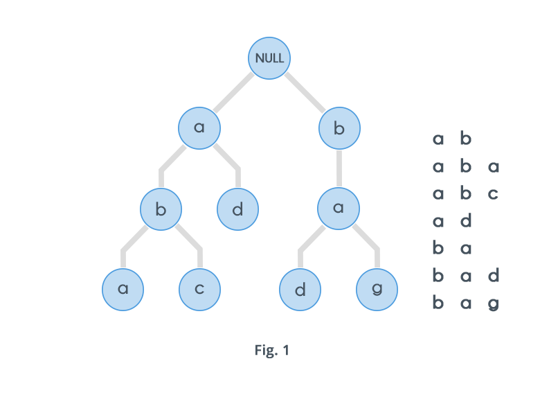

# Prosjekt-repo for TDT4100

[[_TOC_]]

## Om prosjektet
Prosjektet, **SpellIT**, er en Scrabble-applikasjon konfigurert som et multi-modul prosjekt med maven. Applikasjonen består av modulene [Core](spellit/core/README.md) og [UI](spellit/ui/README.md), og er bygget på prinsippinene for Model-view-controller (MVC). Applikasjonen er laget slik at to spillere kan spille mot hverandre på samme datamaskin. Videre støtter applikasjonen persistens/lagring av data ved å serialisere Java-objekter til en JSON-fil. Det spilles på tur, og for hver tur kan spilleren plassere tilgjengelige brikker på brettet for å danne et nytt ord. Ordet som blir lagt verifiseres ved å slå opp i applikasjonens innebygde [ordbok](spillets-ordbok) - det beregnes også poeng for nye ord som blir dannet med tidligere plasserte brikker.

### Spillets ordbok
Spillet benytter en norsk ordbok, og støtter omlag **334 000** varianter av norske ord. Ettersom applikasjonen hyppig benytter seg av denne ordboken er det kritisk med rask oppslagstid. Dette er oppnådd ved bruk av en datastruktur kalt **Trie**, illustrert nedenfor.



En Trie er en trestruktur hvor hver node består av flere forgreninger, og hver gren representerer alfabetisk karakter. På denne måten kan applikasjonen verifisere ord ved å følge hver bokstav i oppslagsordet, og se om kombinasjonen av bokstaver eksisterer i Trie-strukturen - en slik operasjon vil ta **O(n)** kjøretid, hvor **n** er lengden oppslagsordet.

### Moduler
Prosjektets moduler tilhører pom-filen [spellit](spellit/pom.xml), og er ytteligere beskrevet i egne README-filer.
- **[spellit.core](spellit/core/README.md)** utgjør domenelaget, og inneholder standardiserte objekter samt. logikk for å fremstille disse objektene.
- **[spellit.ui](spellit/ui/README.md)** utgjør brukergrensesnittet, og bygget med **JavaFx**.
- **[spellit.report](spellit/report/README.md)** aggregerer resultat for testdekningsgrad i en samlet rapport.

### Forhåndsvisning av SpellIT


## Bygging med Maven

### Dependencies
- [(**jackson-databind**)](https://mvnrepository.com/artifact/com.fasterxml.jackson.core/jackson-databind) - se-/derialisering av Java-objekter til JSON.
- [(**javafx-controls**)](https://mvnrepository.com/artifact/org.openjfx/javafx-controls) - JavaFx-bibliotek
- [(**javafx-fxml**)](https://mvnrepository.com/artifact/org.openjfx/javafx-fxml) - bruk av FXML-filer
- [(**junit-jupiter-api**)](https://mvnrepository.com/artifact/org.junit.jupiter/junit-jupiter-api) - JUnit API
- [(**mockito-core**)](https://mvnrepository.com/artifact/org.mockito/mockito-core) - Mockito
- [(**testfx-core**)](https://mvnrepository.com/artifact/org.testfx/testfx-core) - core for testing av JavaFx-applikasjoner
- [(**testfx-junit5**)](https://mvnrepository.com/artifact/org.testfx/testfx-junit5) - integrerer TestFx med Junit


### Plugins
- [(**maven-compiler-plugin**)](https://maven.apache.org/plugins/maven-compiler-plugin/) - kompilerer source-filene i prosjektet
- [(**maven-surefire-plugin**)](https://maven.apache.org/surefire/maven-surefire-plugin/) - kjøring av enhetstester
- [(**maven-checkstyle-plugin**)](https://checkstyle.sourceforge.io) - sjekking av kodekvalitet med **Checkstyle** 
- [(**spotbugs-maven-plugin**)](https://spotbugs.github.io) - finner bugs i koden med **Spotbugs**
- [(**jacoco-maven-plugin**)](https://github.com/jacoco/jacoco) - testdekningsgrad med **Jacoco**
- [(**javafx-maven-plugin**)](https://github.com/openjfx/javafx-maven-plugin) - kjøring av **JavaFx-applikasjonen**

## Kommandoer
Rydder opp i tidligere kompilerte filer, og installerer avhengigheter

```mvn clean install```

Kjører gjennom enhetstestene

```mvn test```

Starter applikasjonen

```mvn javafx:run -f ui/pom.xml```
